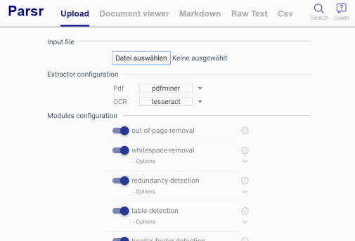
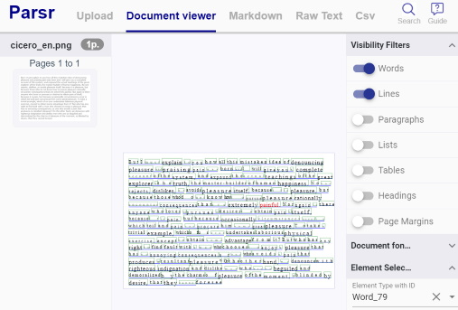

# Parsr (axa-group)

Checking out [axa-group/Parsr](https://github.com/axa-group/Parsr)

## Getting Started

Startup Parsr using `docker-compose up` and hit the UI at [localhost:8080](http://localhost:8080).

Next upload a scanned image to parse and watch the result.

